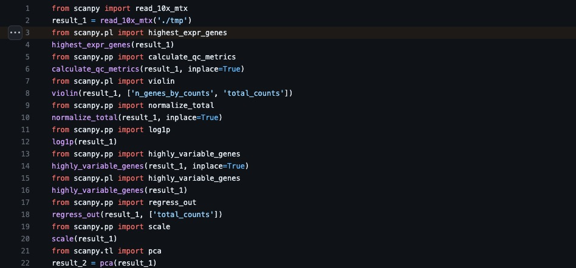
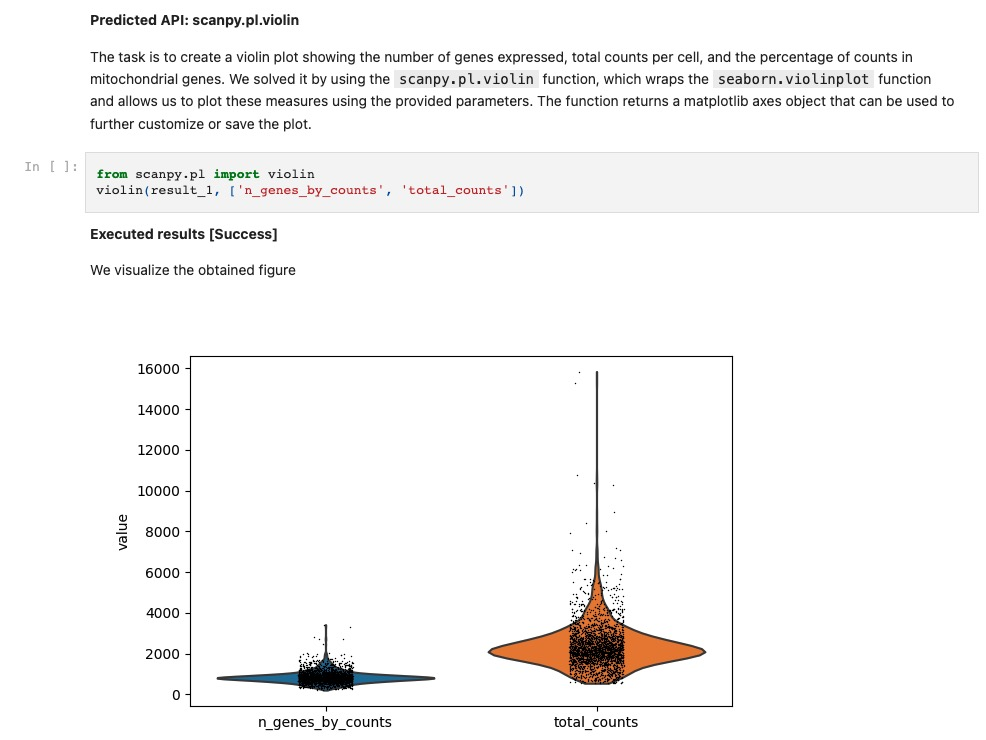

<div align="center" style="display: flex; align-items: center; justify-content: center;">
  <a href="https://github.com/batmen-lab/BioMANIA" target="_blank">
    
  </a>
  <h1 style="margin: 0; white-space: nowrap;">BioMANIA</h1>
</div>

<p align="center">
  <a target="_blank" href="https://www.biorxiv.org/content/10.1101/2023.10.29.564479v1">
    
  </a>
  <a target="_blank" href="https://github.com/batmen-lab/BioMANIA">
    
  </a>
  <a target="_blank" href="https://railway.app/template/WyEd-d">
    
  </a>
  <a target="_blank" href="https://hub.docker.com/repositories/chatbotuibiomania">
    
  </a>
</p>

Welcome to the BioMANIA! This guide provides detailed instructions on how to set up, run, and interact with the BioMANIA chatbot interface, which connects seamlessly with various APIs to deliver information across numerous libraries and frameworks.

Importantly, this README primarily supports the conversion of PyPI tools. We also offer tutorial of conversions for [Python source code](Git2APP.md) and [R](R2APP.md) (231123-Still under developing)! Please refer to the separate README for these processes.

🌟 We warmly invite you to share your trained models and datasets in our [issues section](https://github.com/batmen-lab/BioMANIA/issues/2), making it easier for others to utilize and extend your work, thus amplifying its impact. Feel free to explore and provide feedback on tools shared by other contributors as well! 🚀🔍

## Video demo

Our demonstration showcases how to utilize a chatbot to simultaneously use scanpy and squidpy in a single conversation, including loading data, invoking functions for analysis, and presenting outputs in the form of code, images, and tables


## Web access online demo

We provide an [online demo](https://biomania.ngrok.io/en) hosted on our server! And an [online demo](https://biomania-frontend-production-4095.up.railway.app/en) hosted on railway.

Tips:
- Some tools need an individual environment (like qiime2, scenicplus) and we can not include them all in a single `requirements.txt`. Under this case, currently you need to switch to that conda environment manually and run with script. 
- We have implemented switching different libraries inside one dialog. You can 
- Notice that the inference speed depends on OpenAI key and back-end device. A paid OpenAI key and running back-end on GPU will speed up the inference quite a lot!
- All uploaded files are saved under `./tmp` folder. Please enter `./tmp/`+your_file_name when the API requires filename parameters.
- It will be quite slow if the file for transmission is large. If the file transfer is too large, you may encounter the following issue: "JavaScript heap memory exhaustion caused by excessive memory usage or memory leaks in the program.". **You can copy the file under `src/tmp/` folder directly.**

> **This has only one backend, which may lead to request confusion when multiple users request simultaneously. The stability of the operation is affected by the device's network. When it runs on the CPU, switching between different libraries takes about half a minute to load models and data. We recommend prioritizing running it locally with GPU, which takes only about 3 seconds to switch between different libraries!**

## Quick start

We provide a Railway deployment template that allows you to deploy to Railway with a single click.

[](https://railway.app/template/WyEd-d)

You'll need to fill in the `OpenAI_API_KEY` in the Variables page of the biomania-backend service. Then, manually enable `Public Domain` in the Settings/Networking session for both front-end and back-end service. Copy the url from back-end as `https://[copied url]` and paste it in `BACKEND_URL` in front-end Variables page. For front-end url, paste it to the browser to access the frontend.

## Project Overview

Our project workflow is depicted in the images below, showcasing the pipeline, chatbot UI, and tutorials.

Project Overview:
Our project pipeline is illustrated below:


## Run with Railway

Refer to section `Quick start` for deployment instructions.

## Run with Docker

For ease of use, we provide Docker images for both the frontend and backend services.

```bash
# Pull back-end service and front-end UI service with:
docker pull chatbotuibiomania/biomania-together:v1.1.3
```

Start service with
```bash
# run on gpu
docker run -e OPENAI_API_KEY="" --gpus all -d -p 3000:3000 chatbotuibiomania/biomania-together:v1.1.3
# or on cpu
docker run -e OPENAI_API_KEY="" -d -p 3000:3000 chatbotuibiomania/biomania-together:v1.1.3
```

Then check UI service with `http://localhost:3000/en`.

Important Tips for Running Docker Without Bugs:
- Be careful for the `http/https`, `PORT`, `url` in `chatbot_ui_biomania/utils/server/index.ts`, and the effectiveness of the API key, as they will affect the connection between backend and frontend service.
- To run docker on GPU, you need to install `nvidia-docker` and [`nvidia container toolkit`](https://docs.nvidia.com/datacenter/cloud-native/container-toolkit/install-guide.html). Run `docker info | grep "Default Runtime"` to check if your device can run docker with gpu.
- Feel free to adjust the [cuda image version](https://hub.docker.com/r/nvidia/cuda/tags?page=1) inside the `src/Dockerfile` to configure it for different CUDA settings which is compatible for your device, or you can remove the `runtime: nvidia` from the `docker-compose.yml` to run it using the CPU.
- Please double check that the firewall allows communication between containers.

### Setting up services on separate devices

If you're operating the front-end and back-end services on separate devices, pull the frontend and backend service separately on different devices.
```bash
# Pull front-end UI service with:
docker pull chatbotuibiomania/biomania-frontend:v1.1.3
# Pull back-end UI service with:
docker pull chatbotuibiomania/biomania-backend:v1.1.3
```

Initiate the [ngrok service](https://ngrok.com/docs/getting-started/) script in a new terminal on the same device with back-end device and get the print url like `https://[ngrok_id].ngrok-free.app` with:
```bash
ngrok http 5000
```

Then you can start front-end UI service with
```bash
docker run -e BACKEND_URL="https://[ngrok_id].ngrok-free.app" -d -p 3000:3000 chatbotuibiomania/biomania-frontend:v1.1.3
```

And run back-end service on another device with
```bash
docker run -e OPENAI_API_KEY="" -d -p 5000:5000 chatbotuibiomania/biomania-backend:v1.1.3
```

## Run with script

### Setting up for environment
To prepare your environment for the BioMANIA project, follow these steps:

1. Clone the repository and install dependencies:
```bash
git clone https://github.com/batmen-lab/BioMANIA.git
cd BioMANIA/src
conda create -n biomania python=3.10
conda activate biomania
pip install -r requirements.txt --index-url https://pypi.org/simple
```

2. Set up your OpenAI API key in the `src/.env` file.
```bash
"OPENAI_API_KEY"="your-openai-api-key-here"
```

- For inference purposes, a standard OpenAI API key is sufficient.
- If you intend to use functionalities such as instruction generation or GPT API predictions, a paid OpenAI account is required as it may reach rate limit. 
- **Feel free to switch to `model_name='gpt-3.5-turbo-16k'` or `gpt-4` in `src/models/model.py` if you want.**

### Prepare for Data and Model
Download the necessary data and models from our [Google Drive link](https://drive.google.com/drive/folders/1vWef2csBMe-PSPqA9pY2IVCY_JT5ac7p?usp=drive_link) or [Baidu Drive link](https://pan.baidu.com/s/1AZgKRfptrUTI3L2YbZwHww?pwd=36fi). For those library data, you can download only the one you need.

Organize the downloaded files at `src/data` or `src/hugging_models` as follows:

```
data
├── conversations
│   ├── test_freq.json
│   ├── test_rare.json
│   ├── train.json
│   ├── valid_freq.json
│   └── valid_rare.json
├── others-data
│   ├── combined_data.csv
│   ├── dialogue_questions.csv
│   ├── final_data.csv
│   ├── qna_chitchat_caring.tsv
│   ├── qna_chitchat_enthusiastic.tsv
│   ├── qna_chitchat_friendly.tsv
│   ├── qna_chitchat_professional.tsv
│   ├── qna_chitchat_witty.tsv
│   ├── test_data.csv
│   └── train_data.csv
└── standard_process
    ├── scanpy
    │   ├── API_composite.json
    │   ├── API_init.json
    │   ├── API_inquiry.json
    │   ├── API_inquiry_annotate.json
    │   ├── API_instruction_testval_query_ids.json
    │   ├── Composite_API.py
    │   ├── api_data.csv
    │   ├── centroids.pkl
    │   ├── classification_train
    │   ├── retriever_train_data
    │   └── vectorizer.pkl
    └── ...

hugging_models
└── retriever_model_finetuned
    ├── scanpy
    ├── squidpy
    └── ...
```

By meticulously following the steps above, you'll have all the essential data and models perfectly organized for the project.

We provide data and pre-trained models for available tools mentioned in our paper. For experimenting with more libraries, use our library installation service.

We also offer some demo chat, you can find them in [`./demo`](https://github.com/batmen-lab/BioMANIA/blob/main/demo) and use `import data` button to visualize it in chatbot UI. Notice that these demo chat are converted from the PyPI readthedoc tutorials. You can check the original tutorial link through the `tutorial_links.txt`.


### Prepare for front-end UI service

```bash
# Under folder BioMANIA/src/chatbot_ui_biomania
npm i # install
```

### Inference with pretrained models

Start both services for back-end and front-end UI with:
```bash
# Under folder `BioMANIA/`
sh start_script.sh
```

Your chatbot server is now operational at `http://localhost:3000/en`, primed to process user queries.

> **When selecting different libraries on the UI page, the retriever's path will automatically be changed based on the library selected**

### Training from scratch

We provide a robust training script for additional customization and enhancement of the BioMANIA project. Follow the steps in the Training section to modify library settings, download materials, generate JSON files, and train models.

1. Modify the library setting in `Lib_cheatsheet.json`.
```bash
{
    ...
    'scanpy':{
        "LIB":'scanpy',
        "LIB_ALIAS":'scanpy',
        "API_HTML_PATH": 'scanpy.readthedocs.io/en/latest/api/index.html',
        "GITHUB_LINK": "https://github.com/scverse/scanpy",
        "READTHEDOC_LINK": "https://scanpy.readthedocs.io/",
        "TUTORIAL_HTML_PATH":"scanpy.readthedocs.io/en/latest/tutorials",
        "TUTORIAL_GITHUB":"https://github.com/scverse/scanpy-tutorials",
    },
    ...
    # simplest input
    'your_lib':{
        "LIB":'your_lib_name', # NECESSARY
        "LIB_ALIAS":'your_lib_alias', # NECESSARY
        "API_HTML_PATH": null, # OPTIONAL
        "GITHUB_LINK": null, # OPTIONAL
        "READTHEDOC_LINK": null, # OPTIONAL
        "TUTORIAL_HTML_PATH": null, # OPTIONAL
        "TUTORIAL_GITHUB": null, # OPTIONAL
    }
}
```

```bash
export LIB=scanpy
```

> **For example, for `scikit-learn`, the LIB is `scikit-learn`, while the LIB_ALIAS is `sklearn`. API_HTML_PATH is the API list page.**

> **We download API_HTML_PATH instead of the whole READTHEDOC for saving time.**

> **Notice that the READTHEDOC version should be compatible with your PyPI version, otherwise it may ignore some APIs.**

(Optional) Download the necessary readthedoc materials to folder `../../resources/readthedoc_files` with:
```bash
# download materials according to your provided url links
python dataloader/utils/other_download.py --LIB ${LIB}
# generate codes for your downloaded tutorial files, support for either html, ipynb.
python dataloader/utils/tutorial_loader_strategy.py --LIB ${LIB} --file_type 'html'
# These two scripts are required for getting `API_composite.json`. Feel free to skip this if you don't need `API_composite.json`.
```

Install the PyPI library by `pip install {LIB}` or other ways that recommended from their Github.

For further web UI, don't forget to add the new lib information to `BioMANIA/chatbot_ui_biomania/components/Chat/LibCardSelect.tsx`. Also add the new lib logo to `BioMANIA/chatbot_ui_biomania/public/apps/`.

2. Generate API_init.json using the provided script.
```bash
python dataloader/get_API_init_from_sourcecode.py --LIB ${LIB}
```

> **Notice: You might want to DIY the filtering rules in  `filter_specific_apis` inside get_API_init_from_sourcecode.py file. Currently we remove API type with `property/constant/builtin`, remove API without docstring, API without input/output simultaneously. Most retained APIs are of type `function/method/Class`, which is more meaningful for user query inference. You can check your API_init.json and modify rules accordingly!**

3. (Optional) Generate API_composite.json automatically with:
```bash
python dataloader/get_API_composite_from_tutorial.py --LIB ${LIB}
```

If you skip this step, don't forget to generate a file of `./data/standard_process/{LIB}/API_composite.json` to guarantee the following steps can run smoothly.

```bash
cp -r ./data/standard_process/${LIB}/API_init.json ./data/standard_process/${LIB}/API_composite.json
```

4. Following this, create instructions, generate various JSON files, and split the data.
```bash
python dataloader/preprocess_retriever_data.py --LIB ${LIB}
```

Tips:
- The automatically generated API_inquiry_annotate.json do not have human annotated data here, you need to annotate the API_inquiry_annotate.json by yourself if you want to test performance on human annotate data.
- Adjust the maximum concurrency according to the rate limit of OpenAI account. The time cost is related with the total number of APIs in the lib and the OpenAI account.

5. Train the api/non-api classification model.
```bash
python models/chitchat_classification.py --LIB ${LIB}
```

6. (Optional) Test bm25 retriever
```bash
python inference/retriever_bm25_inference.py --LIB ${LIB} --top_k 3
```

7. Fine-tune the retriever.
You can finetune the retriever based on the [bert-base-uncased](https://huggingface.co/bert-base-uncased) model
```bash
export LIB=scanpy
CUDA_VISIBLE_DEVICES=0
mkdir ./hugging_models/retriever_model_finetuned/${LIB}
python models/train_retriever.py \
    --data_path ./data/standard_process/${LIB}/retriever_train_data/ \
    --model_name bert-base-uncased \
    --output_path ./hugging_models/retriever_model_finetuned/${LIB} \
    --num_epochs 25 \
    --train_batch_size 32 \
    --learning_rate 1e-5 \
    --warmup_steps 500 \
    --max_seq_length 256 \
    --optimize_top_k 3 \
    --plot_dir ./plot/${LIB}/retriever/
```

Note that the num_epochs need to be modified according to different tools. You can check the training performance curve under `./src/plot/${LIB}/` to determine the number of epochs.

Or, you can finetune based on pretrained models from other libs.
```bash
export LIB=scanpy
export OTHER_LIB=squidpy
CUDA_VISIBLE_DEVICES=0
mkdir ./hugging_models/retriever_model_finetuned/${LIB}
python models/train_retriever.py \
    --data_path ./data/standard_process/${LIB}/retriever_train_data/ \
    --model_name ./hugging_models/retriever_model_finetuned/${OTHER_LIB}/assigned/ \
    --output_path ./hugging_models/retriever_model_finetuned/${LIB} \
    --num_epochs 25 \
    --train_batch_size 32 \
    --learning_rate 1e-5 \
    --warmup_steps 500 \
    --max_seq_length 256 \
    --optimize_top_k 3 \
    --plot_dir ./plot/${LIB}/retriever/
```

test the inference performance using:
```bash 
export LIB=scanpy
export HUGGINGPATH=./hugging_models
CUDA_VISIBLE_DEVICES=0
python inference/retriever_finetune_inference.py  \
    --retrieval_model_path ./hugging_models/retriever_model_finetuned/${LIB}/assigned \
    --corpus_tsv_path ./data/standard_process/${LIB}/retriever_train_data/corpus.tsv \
    --input_query_file ./data/standard_process/${LIB}/API_inquiry_annotate.json \
    --idx_file ./data/standard_process/${LIB}/API_instruction_testval_query_ids.json \
    --retrieved_api_nums 3 \
    --LIB ${LIB}
```

Or compare the inference performance with:
```bash
export HUGGINGPATH=./hugging_models
python inference/retriever_finetune_inference.py  \
    --retrieval_model_path bert-base-uncased \
    --corpus_tsv_path ./data/standard_process/${LIB}/retriever_train_data/corpus.tsv \
    --input_query_file ./data/standard_process/${LIB}/API_inquiry_annotate.json \
    --idx_file ./data/standard_process/${LIB}/API_instruction_testval_query_ids.json \
    --retrieved_api_nums 3 \
    --LIB ${LIB}
```

You can refer to `src/plot/${LIB}/error_train.json` for detailed error case.

8. Test api name prediction using either the gpt baseline or the classification model.

GPT-baseline

**Run code inside gpt_baseline.ipynb to check results.** You can either choose top_k, gpt3.5/gpt4 model, random shot/similar shot example, narrowed retrieved api list/whole api list parameters here. The performance described in our paper was evaluated using GPT versions GPT-3.5-turbo-16k-0613 and GPT-4-0613.

Besides, even though we use gpt prompt to predict api, we also provide an api-name prediction classification model

Please refer to [lit-llama](https://github.com/Lightning-AI/lit-llama) for getting llama weights and preprocessing. 

process data:
```bash
CUDA_VISIBLE_DEVICES=0
export TOKENIZERS_PARALLELISM=true
python models/data_classification.py \
    --pretrained_path ./hugging_models/llama-2-finetuned/checkpoints/lite-llama2/lit-llama.pth \
    --tokenizer_path ./hugging_models/llama-2-finetuned/checkpoints/tokenizer.model \
    --corpus_tsv_path ./data/standard_process/${LIB}/retriever_train_data/corpus.tsv \
    --retriever_path ./hugging_models/retriever_model_finetuned/${LIB}/assigned/ \
    --data_dir ./data/standard_process/${LIB}/API_inquiry_annotate.json \
    --out_dir ./hugging_models/llama-2-finetuned/${LIB}/finetuned/ \
    --plot_dir ./plot/${LIB}/classification \
    --device_count 1 \
    --top_k 10 \
    --debug_mode "1" \
    --save_path ./data/standard_process/${LIB}/classification_train \
    --idx_file ./data/standard_process/${LIB}/API_instruction_testval_query_ids.json \
    --API_composite_dir ./data/standard_process/${LIB}/API_composite.json \
    --batch_size 8 \
    --retrieved_path ./data/standard_process/${LIB} \
    --LIB ${LIB}
```

Then, finetune model:
```bash
CUDA_VISIBLE_DEVICES=0 \
python models/train_classification.py \
    --data_dir ./data/standard_process/${LIB}/classification_train/ \
    --out_dir ./hugging_models/llama-2-finetuned/${LIB}/finetuned/ \
    --plot_dir ./plot/${LIB}/classification \
    --max_iters 120 \
    --batch_size 8
```

Finally, check the performance:
```bash
CUDA_VISIBLE_DEVICES=0 \
python models/inference_classification.py \
    --data_dir ./data/standard_process/${LIB}/classification_train/ \
    --checkpoint_dir ./hugging_models/llama-2-finetuned/${LIB}/finetuned/combined_model_checkpoint.pth \
    --batch_size 1
```

## Report Generation

BioMANIA can generate various reports, including Python files, Jupyter notebooks, performance summaries, and common issue logs. Follow the instructions in the Report Generation section to create these reports.

### For chat Python File: 

Firstly, press `export chat` button on UI to get the chat json data. Convert the chat JSON into a Python code using the Chat2Py.py script.

```bash
# cd src
python report/Chat2Py.py report/demo_Preprocessing_and_clustering_3k_PBMCs.json
```



### For chat report

Convert the chat JSON into an [ipynb report](https://github.com/batmen-lab/BioMANIA/blob/main/src/report/demo_Preprocessing_and_clustering_3k_PBMCs.ipynb) using the Chat2jupyter.py script.

```bash
# cd src
python report/Chat2jupyter.py report/demo_Preprocessing_and_clustering_3k_PBMCs.json
```



### For performance report

Combine and sort the performance figures into a short report.

```bash
# cd src
python report/PNG2report.py scanpy
```

Please note that the generation of this report must be based on the premise that the retriever models have already been trained, and the gpt baseline has already been tested. You need to first obtain the results of each model before running this script. Here is a reference for a [demo report](https://github.com/batmen-lab/BioMANIA/tree/main/src/report/performance_report.pdf).


### For common issue report

Displaying common issues in the process of converting Python tools into libraries

```bash
# cd src
python report/Py2report.py scanpy
```

The output files are located in the ./report folder.


## Share your APP!

If you want to share your APP to others, there are two ways.

### Share docker

You can build docker and push to dockerhub, and share your docker image url in [our issue](https://github.com/batmen-lab/BioMANIA/issues/2).
```bash
# cd BioMANIA
docker build -t [docker_image_name] -f Dockerfile ./
# run on cpu
docker run -e OPENAI_API_KEY=[your_OPENAI_API_KEY] -d -p 3000:3000 [docker_image_name]
# (optional)run on cuda
docker run -e OPENAI_API_KEY=[your_OPENAI_API_KEY] --gpus all -d -p 3000:3000 [docker_image_name]
# (optional)push to docker
docker push [your_docker_repo]/[docker_image_name]:[tag]
```

Notice if you want to include some data inside the docker, please modify the `Dockerfile` carefully to copy the folders to `/app`. Also add your PyPI or Git pip install url to the `requirements.txt` before your packaging for docker.

### Share data/models

You can just share your `data` and `hugging_models` folder and `logo` image by drive link to [our issue](https://github.com/batmen-lab/BioMANIA/issues/2).


## Reference and Acknowledgments

We extend our gratitude to the following references:
- [Toolbench](https://github.com/OpenBMB/ToolBench) 
- [Chatbot-UI](https://github.com/mckaywrigley/chatbot-ui)
- [Toolbench-UI](https://github.com/lilbillybiscuit/chatbot-ui-toolllama)
- [Retriever](https://huggingface.co/bert-base-uncased)
- [Topical-Chat-data](https://github.com/alexa/Topical-Chat)
- [ChitChat-data](https://github.com/microsoft/botframework-cli/blob/main/packages/qnamaker/docs/chit-chat-dataset.md)
- [lit-llama](https://github.com/Lightning-AI/lit-llama)

Thank you for choosing BioMANIA. We hope this guide assists you in navigating through our project with ease.

TODO:

We will provide the below files and the data of more tools later

```
report/Py2report.py
```

## Version History
- v1.1.8 (comming soon)
- v1.1.7 (2023-12-01)
  - Added [SONATA tutorial](./demo/sonata_SNARE_seq.html) and [MIOSTONE tutorial](./demo/MIOSTONE_IBD200.html) to showcase tool usage. Upload data and pretrained models onto [drive](https://drive.google.com/drive/folders/1vWef2csBMe-PSPqA9pY2IVCY_JT5ac7p?usp=drive_link).
  - Fixed bug in class-type APIs that caused errors when using methods. Methods can now be called and used correctly.
  - Resolved program exit issue without error throw. Errors are now handled properly with relevant error messages displayed.
  - Addressed retriever loading issue for specific tools. Indivdual retrievers can now be loaded and utilized correctly for each tool.
  - Enhance Robustness for basic type parameters. When entering `result_*` for basic type parameters, it will show `result_*` instead of `"result_*"` even it is of `str` type.
  - Fix bug of `secrets` variable in `src/gpt/gpt_interface.py`. Change the way to call OpenAI from langchain to OpenAI lib in `models/model.py`
- v1.1.6 (2023-11-27)
  - Support sharing your APP and install others' APP through [our issue](https://github.com/batmen-lab/BioMANIA/issues/2)!
  - Enhance code robustness: 
    - When it returns a tuple, split it to multiple variables by adding code `result_n+1, result_n+2, ... = result_n`. 
    - During parameter inference, if a parameter is of 'NoneType', replace it with 'Any' to run smoothly.
    - Fix bug for adding quotation when user input value for str type parameters.
  - Release a package.
- v1.1.5 (2023-11-25)
  - Enhanced Docker Integration: Now featuring seamless packaging of both front-end and back-end components using Docker. This update simplifies deployment processes, ensuring a more streamlined development experience. We update `chatbotuibiomania/biomania-together:v1.1.3`.
  - Automated Docstring Addition: Users can now effortlessly convert GitHub source code to our tool with scripts that automatically add docstrings, freeing them from the manual effort previously required.
- v1.1.4 (2023-11-22)
  - Add [`manual`](R2APP.md) support for converting R code to API_init.json. Will support for converting R code to APP later!
  - Release docker v1.1.3 with support for 12 PyPI biotools. Notice that some tools are only available under their own conda environment!! We update `chatbotuibiomania/biomania-frontend:v1.1.3` and `chatbotuibiomania/biomania-backend:v1.1.3`.
  - Resolved issues related to Docker networking and Docker CUDA.
  - Improved the stability of the server demo by ensuring that it runs continuously in the background.
- v1.1.3 (2023-11-20)
  - Support web access on our server. Provide data/models for 12 tools mentioned in our paper through drive link.
  - Upload Composite API generation related codes.
  - Add demo chat for these tools under `BioMANIA/demo`.
  - Support manually set maximum concurrency for bulk instruction generation, added a visualization bar.
- v1.1.2 (2023-11-17)
  - Release docker v1.1.2 with support for 8 PyPI bio tools. We will release more libs in a later version.
  - Add [`manual`](Git2APP.md) support for converting github repo/source code to BioMANIA APP.
  - Support for switching libs during a dialog. Now you can let multiple tool cooperate inside one dialog!
- v1.1.1 (2023-11-10)
  - Initial release with analysis pipeline for `scanpy`.
  - Add one-click deploy using railway.

## Star History

[](https://star-history.com/#batmen-lab/BioMANIA&Date)
