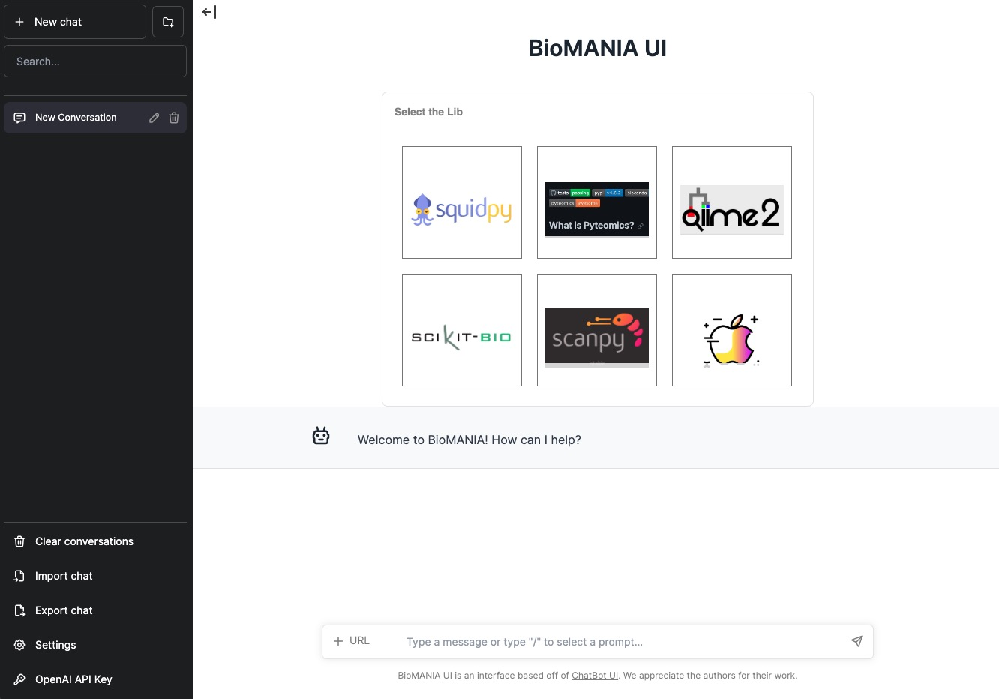

## BioMANIA Project

Welcome to the BioMANIA Project! This guide provides detailed instructions on how to set up, run, and interact with the BioMANIA chatbot interface, which connects seamlessly with various APIs to deliver information across numerous libraries and frameworks.

### Project Overview

Our project workflow is depicted in the images below, showcasing the pipeline, chatbot UI, and demos.

Project Overview:
Our project pipeline is illustrated below:


Chatbot UI 


Here are some scanpy demos 


### Run with Railway

We provide a Railway deployment template that allows you to deploy to Railway with a single click. 

[](https://railway.app/template/Mp32Sg?referralCode=iEkWIc)

You'll need to fill in the `OpenAI_API_KEY` in the Variables page of the biomania-backend service. Then, manually enable 'Public Domain' in the Settings/Networking session for both front-end and back-end service. Copy the url from back-end as `https://[copied url]` and paste it in `BACKEND_URL` in front-end Variables page. For front-end url, paste it to the browser to access the frontend.

> **Railway offers CPU-only runtime, and Docker deployment takes approximately 2 minutes. After obtaining a public domain, it may take around 1 minute before available. When switching to different libraries while using the frontend, data and models will be reloaded, taking approximately 1 minute.**

> **Our template currently provides version docker:v2, and it will be updated with the latest versions in the future.**

### Run with Docker

For ease of use, we provide Docker images for both the frontend and backend services, specific to the Scanpy library at present. Future releases will expand this capability.

> **For the Docker v2 demo, we have released a Docker image that includes the available models and data for `Scanpy`. At the moment, you can only check the execution for Scanpy under the v2 version. We are planning to release v3 later, which will accommodate more data and installation service.**

> **To use installation service, please follow python scripts to add new library currently.**

Start front-end UI service with:
```shell
docker pull chatbotuibiomania/biomania-frontend:v2
docker run -d -p 3000:3000 chatbotuibiomania/biomania-frontend:v2
```

Start back-end UI service with:
```shell
docker pull chatbotuibiomania/biomania-backend:v2
docker run -e OPENAI_API_KEY="your-openai-api-key-here" -d -p 5000:5000 chatbotuibiomania/biomania-backend:v2
```

#### Setting up services on separate devices

If you're operating the front-end and back-end services on separate devices, initiate the [ngrok service](https://ngrok.com/docs/getting-started/) script in a new terminal on the same device with back-end device and get the print url like `https://[ngrok_id].ngrok-free.app` with:
```shell
ngrok http 5000
```

Then you can start front-end UI service with
```shell
docker run -e BACKEND_URL="https://[ngrok_id].ngrok-free.app" -d -p 3000:3000 chatbotuibiomania/biomania-frontend:v2
```

### Run with script

#### Setting up for environment
To prepare your environment for the BioMANIA project, follow these steps:

1. Clone the repository and install dependencies:
```shell
git clone https://github.com/batmen-lab/BioMANIA.git
cd BioMANIA/src
conda create -n biomania python=3.10
conda activate biomania
pip install -r requirements.txt
```

2. Set up your OpenAI API key in the `src/.env` file.
```shell
"OPENAI_API_KEY"="your-openai-api-key-here"
```

For inference purposes, a standard OpenAI API key is sufficient.
If you intend to use functionalities such as instruction generation or GPT API predictions, a paid OpenAI account is required as it may reach rate limit.

#### Data and Model Organization
Download the necessary data and models from our [Google Drive link](https://drive.google.com/drive/folders/1vWef2csBMe-PSPqA9pY2IVCY_JT5ac7p?usp=drive_link).

Organize the downloaded files as follows:

#### Data Organization:

Place data files in: `src/data/standard_process/${LIB}/`

#### Model Organization:

Store model files in:  `src/hugging_models/retriever_model_finetuned/${LIB}/assigned/`

#### Chitchat Data and Model Organization:

Files should be located at: `src/data/`

An example of the subfolders within the data folder is shown below:

```
data
├── conversations
│   ├── api_data.csv
│   ├── test_freq.json
│   ├── test_rare.json
│   ├── train.json
│   ├── valid_freq.json
│   └── valid_rare.json
├── others-data
│   ├── api_data.csv
│   ├── combined_data.csv
│   ├── dialogue_questions.csv
│   ├── final_data.csv
│   ├── qna_chitchat_caring.tsv
│   ├── qna_chitchat_enthusiastic.tsv
│   ├── qna_chitchat_friendly.tsv
│   ├── qna_chitchat_professional.tsv
│   ├── qna_chitchat_witty.tsv
│   ├── test_data.csv
│   └── train_data.csv
├── standard_process
│   ├── scanpy
│   │   ├── API_composite.json
│   │   ├── API_init.json
│   │   ├── API_inquiry.json
│   │   ├── API_inquiry_annotate.json
│   │   ├── API_instruction_testval_query_ids.json
│   │   ├── retriever_train_data
│   │   ├── vectorizer.pkl
└── └── └── centroids.pkl
```

By meticulously following the steps above, you'll have all the essential data and models perfectly organized for the project.

We provide data and pre-trained models for available tools mentioned in our paper. For experimenting with more libraries, use our library installation service.

We also offer some demo chat, you can download it [here](https://drive.google.com/drive/folders/1V-vZeuKR59kq2IU3W_fW4bNCrZmRlSzD?usp=drive_link) and use `import data` button to visualize it in chatbot UI

#### Inference

To get the UI running without Docker, you can use our script for inference. We use LIB=scanpy as an example:

Start back-end UI service with:
```shell
export LIB=scanpy
CUDA_VISIBLE_DEVICES=0 \
python deploy/inference_dialog_server.py \
    --retrieval_model_path ./hugging_models/retriever_model_finetuned/${LIB}/assigned \
    --top_k 3
```

When selecting different libraries on the UI page, the retriever's path will automatically be changed based on the library selected

Install and start the front-end service in a new terminal with:
```shell
cd src/chatbot_ui_biomania
npm i # install
export BACKEND_URL="https://[ngrok_id].ngrok-free.app" # "https://localhost:5000";
npm run dev # run
```

Your chatbot server is now operational at `http://localhost:3000/en`, primed to process user queries.

#### Training

We provide a robust training script for additional customization and enhancement of the BioMANIA project. Follow the steps in the Training section to modify library settings, download materials, generate JSON files, and train models.

1. Modify the library setting in configs/model_config.py.
```shell
LIB = 'scanpy'
USER_INPUT =     
{
    ...
    'scanpy':{
        "LIB":'scanpy',
        "LIB_ALIAS":'scanpy',
        "API_HTML_PATH": 'scanpy.readthedocs.io/en/latest/api/index.html',
        "GITHUB_LINK": "https://github.com/scverse/scanpy",
        "READTHEDOC_LINK": "https://scanpy.readthedocs.io/",
        "TUTORIAL_HTML_PATH":"scanpy.readthedocs.io/en/latest/tutorials",
        "TUTORIAL_GITHUB":"https://github.com/scverse/scanpy-tutorials",
    },
    ...
}
```
Download the necessary materials.

2. Generate API_init.json using the provided script.
```shell
python dataloader/get_API_init_from_sourcecode.py
```

3. (Optional) Generate API_composite.json with another script.
```shell
python dataloader/get_API_composite_from_tutorial.py
```

4. Following this, create instructions, generate various JSON files, and split the data.
```shell
export LIB=scanpy
python dataloader/preprocess_retriever_data.py --LIB ${LIB}
```
Notice that the automatically generated API_inquiry_annotate.json do not have human annotated data here, you need to annotate the API_inquiry_annotate.json by yourself if you want to test performance on human annotate data.

We have implemented the use of asyncio to make requests to OpenAI services, which has reduced the waiting time for the API. However, when the number of API calls is too high, this may reach the rate limit of 180,000 requests per minute for GPT-3.5.

5. Train the api/non-api classification model.
```shell
python models/chitchat_classification.py --LIB ${LIB}
```

6. Test bm25 retriever or fine-tune the retriever.
```shell
python inference/retriever_bm25_inference.py --LIB ${LIB} --top_k 3
```

Or, you can finetune the retriever based on the [bert-base-uncased](https://huggingface.co/bert-base-uncased) model
```shell
mkdir ./hugging_models/retriever_model_finetuned/${LIB}
python models/train_retriever.py \
    --data_path ./data/standard_process/${LIB}/retriever_train_data/ \
    --model_name bert-base-uncased \
    --output_path ./hugging_models/retriever_model_finetuned/${LIB} \
    --num_epochs 25 \
    --train_batch_size 32 \
    --learning_rate 1e-5 \
    --warmup_steps 500 \
    --max_seq_length 256 \
    --optimize_top_k 3 \
    --plot_dir ./plot/${LIB}/retriever/
```

test the inference using:
```shell 
export HUGGINGPATH=./hugging_models
python inference/retriever_finetune_inference.py  \
    --retrieval_model_path ./hugging_models/retriever_model_finetuned/${LIB}/assigned \
    --corpus_tsv_path ./data/standard_process/${LIB}/retriever_train_data/corpus.tsv \
    --input_query_file ./data/standard_process/${LIB}/API_inquiry_annotate.json \
    --idx_file ./data/standard_process/${LIB}/API_instruction_testval_query_ids.json \
    --retrieved_api_nums 3 \
    --LIB ${LIB}

export HUGGINGPATH=./hugging_models
python inference/retriever_finetune_inference.py  \
    --retrieval_model_path bert-base-uncased \
    --corpus_tsv_path ./data/standard_process/${LIB}/retriever_train_data/corpus.tsv \
    --input_query_file ./data/standard_process/${LIB}/API_inquiry_annotate.json \
    --idx_file ./data/standard_process/${LIB}/API_instruction_testval_query_ids.json \
    --retrieved_api_nums 3 \
    --LIB ${LIB}
```

7. Test api name prediction using either the gpt baseline or the classification model.

GPT-baseline

Run code inside gpt_baseline.ipynb to check results. You can either choose top_k, gpt3.5/gpt4 model, random shot/similar shot example, narrowed retrieved api list/whole api list parameters here. The performance described in our paper was evaluated using GPT versions GPT-3.5-turbo-16k-0613 and GPT-4-0613.

Besides, even though we use gpt prompt to predict api, we also provide an api-name prediction classification model

Please refer to [lit-llama](https://github.com/Lightning-AI/lit-llama) for getting llama weights and preprocessing. 

process data:
```shell
CUDA_VISIBLE_DEVICES=0
export TOKENIZERS_PARALLELISM=true
python models/data_classification.py \
    --pretrained_path ./hugging_models/llama-2-finetuned/checkpoints/lite-llama2/lit-llama.pth \
    --tokenizer_path ./hugging_models/llama-2-finetuned/checkpoints/tokenizer.model \
    --corpus_tsv_path ./data/standard_process/${LIB}/retriever_train_data/corpus.tsv \
    --retriever_path ./hugging_models/retriever_model_finetuned/${LIB}/assigned/ \
    --data_dir ./data/standard_process/${LIB}/API_inquiry_annotate.json \
    --out_dir ./hugging_models/llama-2-finetuned/${LIB}/finetuned/ \
    --plot_dir ./plot/${LIB}/classification \
    --device_count 1 \
    --top_k 10 \
    --debug_mode "1" \
    --save_path ./data/standard_process/${LIB}/classification_train \
    --idx_file ./data/standard_process/${LIB}/API_instruction_testval_query_ids.json \
    --API_composite_dir ./data/standard_process/${LIB}/API_composite.json \
    --batch_size 8 \
    --retrieved_path ./data/standard_process/${LIB} \
    --LIB ${LIB}
```

Then, finetune model:
```shell
CUDA_VISIBLE_DEVICES=0 \
python models/train_classification.py \
    --data_dir ./data/standard_process/${LIB}/classification_train/ \
    --out_dir ./hugging_models/llama-2-finetuned/${LIB}/finetuned/ \
    --plot_dir ./plot/${LIB}/classification \
    --max_iters 120 \
    --batch_size 8
```

Finally, check the performance:
```shell
CUDA_VISIBLE_DEVICES=0 \
python models/inference_classification.py \
    --data_dir ./data/standard_process/${LIB}/classification_train/ \
    --checkpoint_dir ./hugging_models/llama-2-finetuned/${LIB}/finetuned/combined_model_checkpoint.pth \
    --batch_size 1
```

### Report Generation

BioMANIA can generate various reports, including Python files, Jupyter notebooks, performance summaries, and common issue logs. Follow the instructions in the Report Generation section to create these reports.

#### For chat Python File: 

Firstly, press `export chat` button on UI to get the chat json data. Convert the chat JSON into a Python code using the Chat2Py.py script.

```shell
python report/Chat2Py.py report/demo_Preprocessing_and_clustering_3k_PBMCs.json
```


#### For chat report

Convert the chat JSON into an [ipynb report](https://github.com/batmen-lab/BioMANIA/blob/main/src/report/demo_Preprocessing_and_clustering_3k_PBMCs.ipynb) using the Chat2jupyter.py script.

```shell
python report/Chat2jupyter.py report/demo_Preprocessing_and_clustering_3k_PBMCs.json
```


#### For performance report

Combine and sort the performance figures into a short report.

```shell
python report/PNG2report.py scanpy
```

Please note that the generation of this report must be based on the premise that the models have already been trained. You need to first obtain the results of each model before running this script. Here is a reference for a [demo report](https://github.com/batmen-lab/BioMANIA/tree/main/src/report/performance_report.pdf).


#### For common issue report

Displaying common issues in the process of converting Python tools into libraries

```shell
python report/Py2report.py scanpy
```

The output files are located in the ./report folder.

### Reference and Acknowledgments

We extend our gratitude to the following references:
- [Toolbench](https://github.com/OpenBMB/ToolBench) 
- [Chatbot-UI](https://github.com/mckaywrigley/chatbot-ui)
- [Toolbench-UI](https://github.com/lilbillybiscuit/chatbot-ui-toolllama)
- [Retriever](https://huggingface.co/bert-base-uncased)
- [Topical-Chat-data](https://github.com/alexa/Topical-Chat)
- [ChitChat-data](https://github.com/microsoft/botframework-cli/blob/main/packages/qnamaker/docs/chit-chat-dataset.md)
- [lit-llama](https://github.com/Lightning-AI/lit-llama)

Thank you for choosing BioMANIA. We hope this guide assists you in navigating through our project with ease.

TODO:

We will provide the below files and the data of more tools later

```shell
dataloader/get_API_composite_from_tutorial.py
report/Py2report.py
```

### Version History

- v2 (2023-11-10)
  - Initial release with analysis pipeline for `scanpy`.
  - Add one-click deploy using railway.