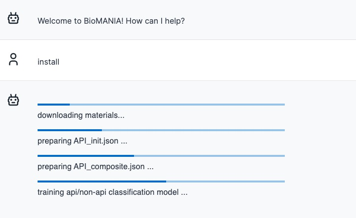
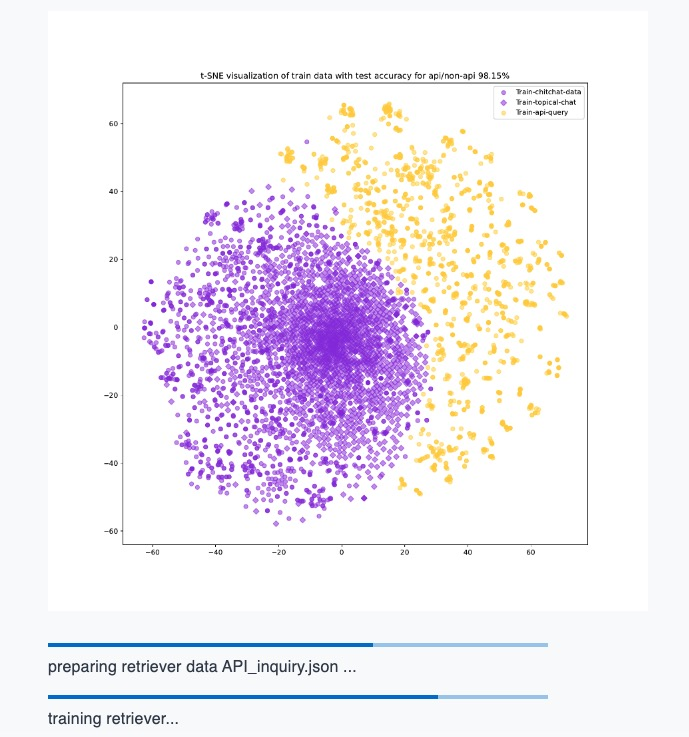
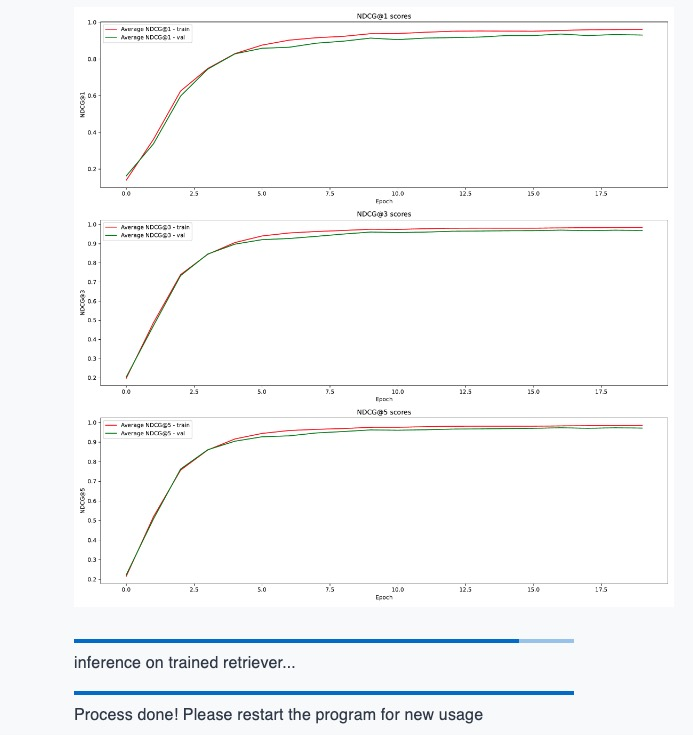

### ReadMe for BioMANIA Project

Welcome to the BioMANIA Project! This README provides a comprehensive guide to set up, run, and understand the BioMANIA project. Our primary focus is to offer a chatbot interface that seamlessly interacts with APIs, providing answers related to a range of libraries and frameworks.

Project Overview:
Our project pipeline is illustrated below:


We provide a demo chatbot UI 


### setting up
To get started, download the code and set up the required environment:

```shell
git clone https://github.com/batmen-lab/BioMANIA.git
cd src
pip install -r requirements.txt
```

### User Interface (UI)
The BioMANIA project UI allows for an interactive session with the chatbot. Here's a brief on the code and how to get the UI up and running:

For our demos, we use LIB=scanpy as an example:

```shell
export LIB=scanpy
CUDA_VISIBLE_DEVICES=0 \
python deploy/inference_dialog_server.py \
    --retrieval_model_path ./retriever_model_finetuned/${LIB}/assigned/ \
    --top_k 3 \
    --device_count 1
```
Upon executing the above, the back-end service will be initialized.

If you're operating the front-end and back-end services on separate devices, initiate the ngrok service script:
```shell
ngrok http 5000
```

Otherwise, you can skip the above step. Modify the URL in utils/server/index.ts to align with the ngrok page link after running ngrok http 5000:
```shell
export const url = "https://localhost:5000";
```
Finally, install according to the [instructions](https://github.com/batmen-lab/2023_yanglu_biochatbot/tree/main/chatbot_ui_biomania) and start the front-end service with:

run:
```shell
npm run dev
```

Your chatbot server is now operational, primed to install libraries and process user queries.


### Inference
If you prefer to initiate user queries without the installation step, download the necessary data and models from our [Google Drive link](https://drive.google.com/drive/folders/1vWef2csBMe-PSPqA9pY2IVCY_JT5ac7p?usp=drive_link).

Organize the downloaded files as follows:

#### Data Organization:

Place data files in: `src/data/standard_process/${LIB}/`

#### Model Organization:

Store model files in:  `src/hugging_models/retriever_model_finetuned/${LIB}/assigned/`

#### Chitchat Data and Model Organization:

Files should be located at: `src/data/`

An example of the subfolders within the data folder is shown below:

```
data
├── centroids.pkl
├── conversations
│   ├── api_data.csv
│   ├── test_freq.json
│   ├── test_rare.json
│   ├── train.json
│   ├── valid_freq.json
│   └── valid_rare.json
├── others-data
│   ├── api_data.csv
│   ├── combined_data.csv
│   ├── dialogue_questions.csv
│   ├── final_data.csv
│   ├── qna_chitchat_caring.tsv
│   ├── qna_chitchat_enthusiastic.tsv
│   ├── qna_chitchat_friendly.tsv
│   ├── qna_chitchat_professional.tsv
│   ├── qna_chitchat_witty.tsv
│   ├── test_data.csv
│   └── train_data.csv
├── standard_process
│   ├── API_base.json
│   ├── API_inquiry_annotate_ori.json
│   ├── pyteomics
│   ├── qiime2
│   ├── scanpy
│   ├── scikit-bio
│   └── squidpy
└── vectorizer.pkl
```

By meticulously following the steps above, you'll have all the essential data and models perfectly organized for the project.

Currently, we only furnish scanpy data and pre-trained models. For experimenting with more libraries, use our library installation service.

### Installation of new library

Enter the materials link under the custom mode in the library selection. This allows the installation of a new library as illustrated below:







### Training
In addition to the UI service, we also provide a robust training script. Here are the steps for the same:

1. Modify the library setting in configs/model_config.py.
```shell
LIB = 'scanpy'
USER_INPUT =     
{
    ...
    'scanpy':{
        "LIB":'scanpy',
        "LIB_ALIAS":'scanpy',
        "API_HTML_PATH": 'scanpy.readthedocs.io/en/latest/api/index.html',
        "GITHUB_LINK": "https://github.com/scverse/scanpy",
        "READTHEDOC_LINK": "https://scanpy.readthedocs.io/",
        "TUTORIAL_HTML_PATH":"scanpy.readthedocs.io/en/latest/tutorials",
        "TUTORIAL_GITHUB":"https://github.com/scverse/scanpy-tutorials",
    },
    ...
}
```
Download the necessary materials.

2. Generate API_init.json using the provided script.
```shell
python dataloader/get_API_init_from_sourcecode.py
```

3. Generate API_composite.json with another script.
```shell
python dataloader/get_API_composite_from_tutorial.py
```

4. Enter the OpenAI key from a paid account. Following this, create instructions, generate various JSON files, and split the data.
```shell
python dataloader/preprocess_retriever_data.py --LIB scanpy
```
Notice that the automatically generated API_inquiry_annotate.json do not have human annotated data here, you need to annotate the API_inquiry_annotate.json by yourself

5. Train the api/non-api classification model.
```shell
python models/chitchat_classification.py
```

6. Test bm25 retriever or fine-tune the retriever.
```shell
python inference/retriever_bm25_inference.py --LIB scanpy --top_k 1
```

Or, you can finetune the retriever based on the [bert-base-uncased](https://huggingface.co/bert-base-uncased) model
```shell
export LIB=scanpy
mkdir /home/z6dong/BioChat/hugging_models/retriever_model_finetuned/${LIB}
python models/train_retriever.py \
    --data_path ./data/standard_process/${LIB}/retriever_train_data/ \
    --model_name bert-base-uncased \
    --output_path /home/z6dong/BioChat/hugging_models/retriever_model_finetuned/${LIB} \
    --num_epochs 25 \
    --train_batch_size 32 \
    --learning_rate 1e-5 \
    --warmup_steps 500 \
    --max_seq_length 256 \
    --optimize_top_k 3 \
    --plot_dir ./plot/${LIB}/retriever/
```

test the inference using:
```shell 
export LIB=scanpy
export HUGGINGPATH=/home/z6dong/BioChat/hugging_models
python inference/retriever_finetune_inference.py  \
    --retrieval_model_path /home/z6dong/BioChat/hugging_models/retriever_model_finetuned/${LIB}/assigned/ \
    --corpus_tsv_path ./data/standard_process/${LIB}/retriever_train_data/corpus.tsv \
    --input_query_file ./data/standard_process/${LIB}/API_inquiry_annotate.json \
    --idx_file ./data/standard_process/${LIB}/API_instruction_testval_query_ids.json \
    --retrieved_api_nums 1

export LIB=scanpy
export HUGGINGPATH=/home/z6dong/BioChat/hugging_models
python inference/retriever_finetune_inference.py  \
    --retrieval_model_path bert-base-uncased \
    --corpus_tsv_path ./data/standard_process/${LIB}/retriever_train_data/corpus.tsv \
    --input_query_file ./data/standard_process/${LIB}/API_inquiry_annotate.json \
    --idx_file ./data/standard_process/${LIB}/API_instruction_testval_query_ids.json \
    --retrieved_api_nums 1
```

7. Test api name prediction using either the gpt baseline or the classification model.

GPT-baseline

Firstly, change the OpenAI API key in secrets.json, and copy the corresponding json data from ./data/standard_process/${LIB} to ./gpt folder. Then run code inside gpt_baseline.ipynb to check results. You can either choose top_k, gpt3.5/gpt4 model, random shot/similar shot example, narrowed retrieved api list/whole api list parameters here.

Besides, even though we use gpt prompt to predict api, we also provide an api-name prediction classification model

process data:
```shell
CUDA_VISIBLE_DEVICES=0
export LIB=scanpy
export TOKENIZERS_PARALLELISM=true
python models/data_classification.py \
    --pretrained_path /home/z6dong/BioChat/hugging_models/llama-2-finetuned/checkpoints/lite-llama2/lit-llama.pth \
    --tokenizer_path /home/z6dong/BioChat/hugging_models/llama-2-finetuned/checkpoints/tokenizer.model \
    --corpus_tsv_path ./data/standard_process/${LIB}/retriever_train_data/corpus.tsv \
    --retriever_path /home/z6dong/BioChat/hugging_models/retriever_model_finetuned/${LIB}/assigned/ \
    --data_dir ./data/standard_process/${LIB}/API_inquiry_annotate.json \
    --out_dir /home/z6dong/BioChat/hugging_models/llama-2-finetuned/${LIB}/finetuned/ \
    --plot_dir ./plot/${LIB}/classification \
    --device_count 1 \
    --top_k 10 \
    --debug_mode "1" \
    --save_path ./data/standard_process/${LIB}/classification_train \
    --idx_file ./data/standard_process/${LIB}/API_instruction_testval_query_ids.json \
    --API_composite_dir ./data/standard_process/${LIB}/API_composite.json \
    --batch_size 8 \
    --retrieved_path ./data/standard_process/${LIB}
```

Then, finetune model:
```shell
export LIB=scanpy
CUDA_VISIBLE_DEVICES=0 \
python models/train_classification.py \
    --data_dir ./data/standard_process/${LIB}/classification_train/ \
    --out_dir /home/z6dong/BioChat/hugging_models/llama-2-finetuned/${LIB}/finetuned/ \
    --plot_dir ./plot/${LIB}/classification \
    --max_iters 120 \
    --batch_size 8
```

Finally, check the performance:
```shell
export LIB=scanpy
CUDA_VISIBLE_DEVICES=0 \
python models/inference_classification.py \
    --data_dir ./data/standard_process/${LIB}/classification_train/ \
    --checkpoint_dir /home/z6dong/BioChat/hugging_models/llama-2-finetuned/${LIB}/finetuned/combined_model_checkpoint.pth \
    --batch_size 1
```

### Report Generation

We offer code to generate comprehensive reports:

#### For Chat Python File: 

Firstly, press `export chat` button on UI to get the chat json data. Convert the chat JSON into a Python code using the Chat2Py.py script.

```shell
python report/Chat2Py.py ../demo_Preprocessing_and_clustering_3k_PBMCs.json
```

#### For chat report

Convert the chat JSON into a report using the Chat2PDF.py script. 

```shell
python report/Chat2PDF.py ../demo_Preprocessing_and_clustering_3k_PBMCs.json
```

The output files are located in the ./report folder.

### Reference

We extend our gratitude to the following references:
- [Toolbench](https://github.com/OpenBMB/ToolBench) 
- [Chatbot-UI](https://github.com/mckaywrigley/chatbot-ui)
- [Toolbench-UI](https://github.com/lilbillybiscuit/chatbot-ui-toolllama)
- [Retriever](https://huggingface.co/bert-base-uncased)
- [Topical-Chat-data](https://github.com/alexa/Topical-Chat)
- [ChitChat-data](https://github.com/microsoft/botframework-cli/blob/main/packages/qnamaker/docs/chit-chat-dataset.md)
- [lit-llama](https://github.com/Lightning-AI/lit-llama)

Thank you for choosing BioMANIA. We hope this guide assists you in navigating through our project with ease.

