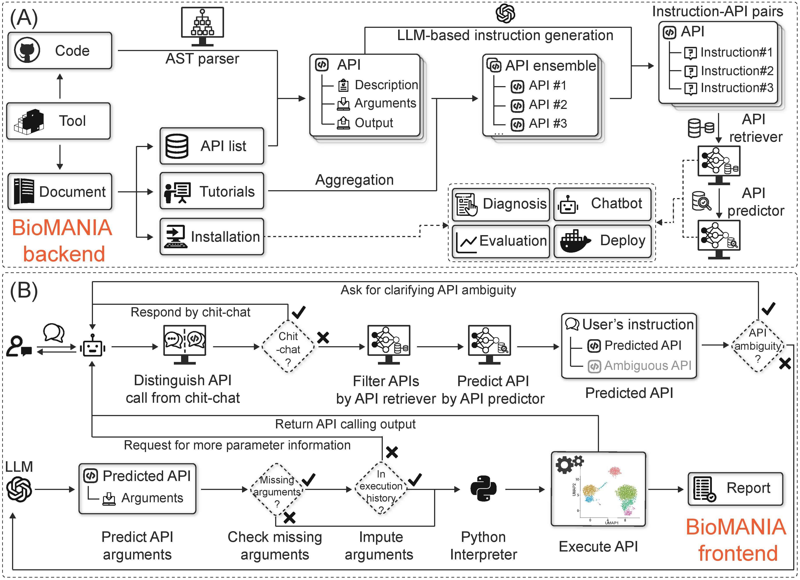
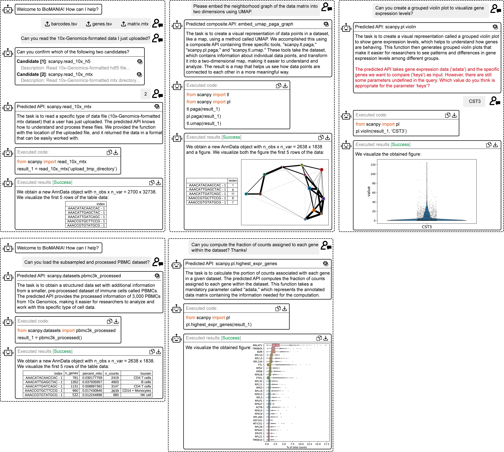

.. container::

   .. raw:: html

      <h1 style="margin: 0; white-space: nowrap;">

   BioMANIA

   .. raw:: html

      </h1>

.. raw:: html

   <p align="center">

.. raw:: html

   </p>

Welcome to the BioMANIA! This guide provides detailed instructions on
how to set up, run, and interact with the BioMANIA chatbot interface,
which connects seamlessly with various APIs to deliver information
across numerous libraries and frameworks.

Project Overview:

|image1|

🌟 We warmly invite you to share your trained models and datasets in our
`issues section <https://github.com/batmen-lab/BioMANIA/issues/2>`__,
making it easier for others to utilize and extend your work, thus
amplifying its impact. Feel free to explore and provide feedback on
tools shared by other contributors as well! 🚀🔍

We welcome 🤗 you to refer to the `Q&A <./docs/Q&A.md>`__ section if you
encounter any problems during your exploration and contribute some
issues for discussion! 🧐 👨‍💻

Video demo
==========

Our demonstration showcases how to utilize a chatbot to simultaneously
use scanpy and squidpy in a single conversation, including loading data,
invoking functions for analysis, and presenting outputs in the form of
code, images, and tables

Web access online demo
======================

We provide an `online demo <https://biomania.serveo.net/en>`__ hosted on
our server!

Quick start
===========

We provide three ways to run the service, Docker, railway, python
script. Among those, Docker is the easiest way to start.

Run with Docker
---------------

For ease of use, we provide Docker images for several tools. You can
refer the detailed tools list from
`dockerhub <https://hub.docker.com/repositories/chatbotuibiomania>`__.

.. code:: bash

   # Pull back-end service and front-end UI service with:
   docker pull chatbotuibiomania/biomania-together:v1.1.9-${LIB}-cuda12.1-ubuntu22.04

Start service with

.. code:: bash

   # run on gpu
   docker run -e LIB=${LIB} -e OPENAI_API_KEY=[your_openai_api_key] --gpus all -d -p 3000:3000 chatbotuibiomania/biomania-together:v1.1.9-${LIB}-cuda12.1-ubuntu22.04
   # or on cpu
   docker run -e LIB=${LIB} -e OPENAI_API_KEY=[your_openai_api_key] -d -p 3000:3000 chatbotuibiomania/biomania-together:v1.1.9-${LIB}-cuda12.1-ubuntu22.04

Then check UI service with ``http://localhost:3000/en``.

Important Tips for Running Docker Without Bugs: - To run docker on GPU,
you need to install ``nvidia-docker`` and
```nvidia container toolkit`` <https://docs.nvidia.com/datacenter/cloud-native/container-toolkit/install-guide.html>`__.
Run ``docker info | grep "Default Runtime"`` to check if your device can
run docker with gpu. - Feel free to adjust the `cuda image
version <https://hub.docker.com/r/nvidia/cuda/tags?page=1>`__ inside the
``Dockerfile`` to configure it for different CUDA settings which is
compatible for your device.

We understand the desire to run the service on a server and visualize
locally. You can initiate the `ngrok
service <https://ngrok.com/docs/getting-started/>`__ by running this
script on your server:

.. code:: bash

   ngrok http 3000

then get the url like ``https://[ngrok_id].ngrok-free.app`` and copy it
to chrome to start!

Run with Railway
----------------

|Deploy on Railway|

To use railway, you’ll need to fill in the ``OpenAI_API_KEY`` in the
Variables page of the biomania-backend service. Then, manually enable
``Public Domain`` in the Settings/Networking session for both front-end
and back-end service. Copy the url from back-end as
``https://[copied url]`` and paste it in ``BACKEND_URL`` in front-end
Variables page. For front-end url, paste it to the browser to access the
frontend.

Run with script
---------------

For instance, let’s take ``scanpy`` as an example. Detailed library
support information can be found in the `Q&A <./docs/Q&A.md>`__

Setting up for environment
~~~~~~~~~~~~~~~~~~~~~~~~~~

To prepare your environment for the BioMANIA project, follow these
steps:

1. Clone the repository and install dependencies:

.. code:: bash

   git clone https://github.com/batmen-lab/BioMANIA.git
   cd BioMANIA
   conda create -n biomania python=3.10
   conda activate biomania
   pip install -r requirements.txt --index-url https://pypi.org/simple
   export PYTHONPATH=$PYTHONPATH:$(pwd)

(Optional) 240421: We provide Git installation. We will later provide a
version that is compatible with external data support.

.. code:: bash

   pip install git+https://github.com/batmen-lab/BioMANIA.git

2. Set up your OpenAI API key in the ``BioMANIA/.env`` file.

.. code:: bash

   "OPENAI_API_KEY"="your-openai-api-key-here"

-  For inference purposes, a standard OpenAI API key is sufficient.
-  If you intend to use functionalities such as instruction generation
   or GPT API predictions, a paid OpenAI account is required as it may
   reach rate limit.
-  **Feel free to switch to ``model_name='gpt-3.5-turbo-0125'`` or
   ``gpt-4-0125-preview`` in ``src/models/model.py`` if you want.**

Prepare for Data and Model
~~~~~~~~~~~~~~~~~~~~~~~~~~

Download the necessary data and models from our `Google Drive
link <https://drive.google.com/drive/folders/1vWef2csBMe-PSPqA9pY2IVCY_JT5ac7p?usp=drive_link>`__
or `Baidu Drive
link <https://pan.baidu.com/s/1AZgKRfptrUTI3L2YbZwHww?pwd=36fi>`__. For
those library data, you can download only the one you need.

We provide a script for downloading models and datas from Google Drive
for scanpy as an example. This works if you are accessible to google.
And don’t forget to rename the retriever model ``multicorpus`` as your
lib name for usage.

.. code:: bash

   sh src/download_data_model.sh

Organize the downloaded files at ``BioMANIA/data`` or
``BioMANIA/hugging_models`` as follows (``base`` are necessary):

::

   data
   ├── conversations
   ├── others-data
   └── standard_process
       ├── base
       │   ├── API_composite.json
       │   └── ...
       ├── scanpy
       │   ├── API_composite.json
       │   └── ...
       ├── {LIB}
       │   ├── API_composite.json
       │   └── ...
       └── ...

   hugging_models
   └── retriever_model_finetuned
       ├── {LIB}
       └── ...

By meticulously following the steps above, you’ll have all the essential
data and models perfectly organized for the project.

We also offer some demo chat, you can find them in
```./examples`` <https://github.com/batmen-lab/BioMANIA/blob/main/examples>`__.
Notice that these demo chat are converted from the PyPI readthedoc
tutorials. You can check the original tutorial link through the
``tutorial_links.txt``.

|image2|

Prepare for front-end UI service
~~~~~~~~~~~~~~~~~~~~~~~~~~~~~~~~

This is compatible with Node.js version 19.

.. code:: bash

   # Under folder BioMANIA/chatbot_ui_biomania
   npm install && npm run build

Inference with pretrained models
~~~~~~~~~~~~~~~~~~~~~~~~~~~~~~~~

Start both services for back-end and front-end UI with:

.. code:: bash

   # Under folder `BioMANIA/`
   sh start_script.sh

Your chatbot server is now operational at ``http://localhost:3000/en``,
primed to process user queries.

   **When selecting different libraries on the UI page, the retriever’s
   path will automatically be changed based on the library selected**

Build your APP!
---------------

Please refer to the separate README for tutorials that supporting
converting different coding tools to our APP. - `For PyPI
Tools <./docs/PyPI2APP.md>`__ - `For Python Source Code from Git
Repo <./docs/Git2APP.md>`__ - `For R Package <./docs/R2APP.md>`__
(231123-Still under developing)

Share your APP!
---------------

If you want to share your pretrained APP to others, there are two ways.

Share docker
~~~~~~~~~~~~

You can build docker and push to dockerhub, and share your docker image
url in `our issue <https://github.com/batmen-lab/BioMANIA/issues/2>`__.
For environment setting of your tool, please refer to
``BioMANIA/docker_utils/{LIB}/`` to add the env files, or modify the
Dockerfile to build your environment.

.. code:: bash

   # cd BioMANIA
   docker build --build-arg LIB=[your_tool_name] -t [docker_image_name] -f Dockerfile ./
   # (optional)push to docker
   docker push [your_docker_repo]/[docker_image_name]:[tag]

Notice if you want to include some data inside the docker, please modify
the ``Dockerfile`` carefully to copy the folders to ``/app``. Also add
your PyPI or Git pip install url to the ``requirements.txt`` before your
packaging for docker.

Share data/models
~~~~~~~~~~~~~~~~~

You can just share your ``data`` and ``hugging_models`` folder and
``logo`` image by drive link to `our
issue <https://github.com/batmen-lab/BioMANIA/issues/2>`__.

Reference and Acknowledgments
-----------------------------

We extend our gratitude to the following references: -
`Toolbench <https://github.com/OpenBMB/ToolBench>`__ -
`Chatbot-UI <https://github.com/mckaywrigley/chatbot-ui>`__ -
`SentenceTransformers <https://github.com/UKPLab/sentence-transformers>`__
- `Topical-Chat-data <https://github.com/alexa/Topical-Chat>`__ -
`ChitChat-data <https://github.com/microsoft/botframework-cli/blob/main/packages/qnamaker/docs/chit-chat-dataset.md>`__
- `lit-llama <https://github.com/Lightning-AI/lit-llama>`__ -
`ollama <https://github.com/ollama/ollama>`__

Thank you for choosing BioMANIA. We hope this guide assists you in
navigating through our project with ease.

Version History
---------------

-  v1.1.10 (2024-04-21)

   -  Add add git installation, add API documentation, add PyPI support.
   -  Add basic pytest cases.

view `version_history <./docs/version_history.md>`__ for more details!

Star History
------------

|Star History Chart|


.. |Deploy on Railway| image:: https://railway.app/button.svg
   :target: https://railway.app/template/qaQEvv

.. |Star History Chart| image:: https://api.star-history.com/svg?repos=batmen-lab/BioMANIA&type=Date
   :target: https://star-history.com/#batmen-lab/BioMANIA&Date
